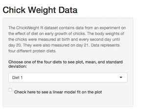

## Introduction

My shiny application uses the ChickWeight R dataset. This dataset contains the body weights of chicks measured at birth and every second day until day 20.  They were also measured on day 21.  The experiment evaluated 4 different protein diets to see which had the most effect on chick weight.  

Here is a sample of what the data look like:
```{r}
head(ChickWeight)

```

--- .class #id 

## User input

My shiny application takes two user inputs:

* Diet
    - drop down selection box allows you to choose one of the four diets 
* Linear regression line
    - checkbox will plot a linear regression line on the scatterplot

Here is a screenshot from the app showing the user inputs: 

<div style='text-align: center;'>
    
</div>

---

## Reactive output

My shiny application shows a scatterplot of Weight and Age in Days for the diet selected by the user.  It will include a linear regression line if the user checks the box to show one.  For example, here is the plot for diet 1, with regression line:

```{r, echo=FALSE}
subData <- subset(ChickWeight, Diet==1)
plot(weight ~ Time, subData, col="blue", 
     main = paste("Chick Weights for Diet 1 with Linear Regression Line"),
     xlab = "Age in Days",
     ylab = "Weight in Grams (gm)")
abline(lm(weight ~ Time, subData), col="red" )
```

---

## Reactive outputs

The app will also show the mean weight and standard deviation for the diet selected:
```{r}
avgWt <- round(mean(subData$weight, na.rm=TRUE), 2)
sDev <- round(sd(subData$weight, na.rm = TRUE), 2)
```
For instance, the mean weight, calculated above for diet 1 is `r avgWt` and the standard deviation is `r sDev`.

## Conclusion
This is a simple application that may not hold much practical use, but it serves as an introduction to shiny and slidify.

To access my shiny app, please visit the following link:
https://jessielr.shinyapps.io/ChickWeight/

To access code files and readme, please visit the following link:
https://github.com/jesslr/ChickWeightApp


